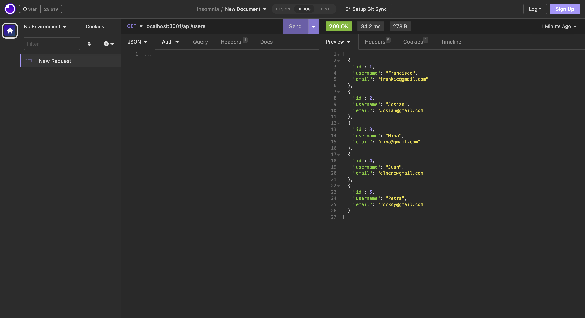
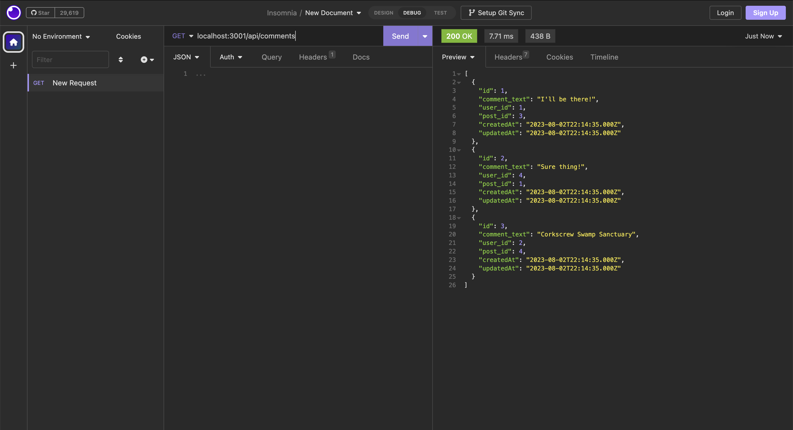
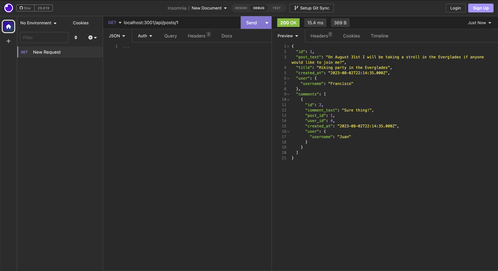
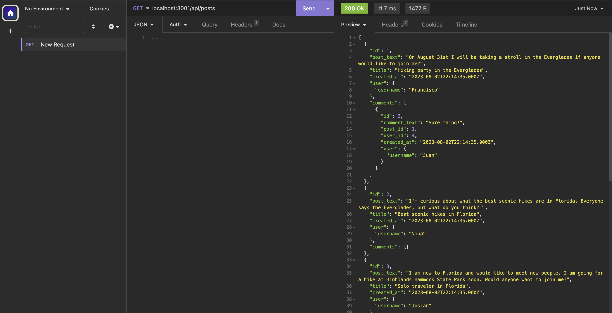
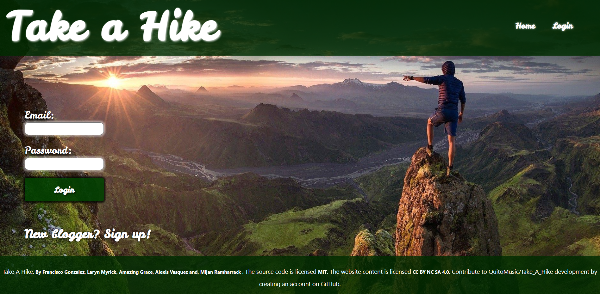
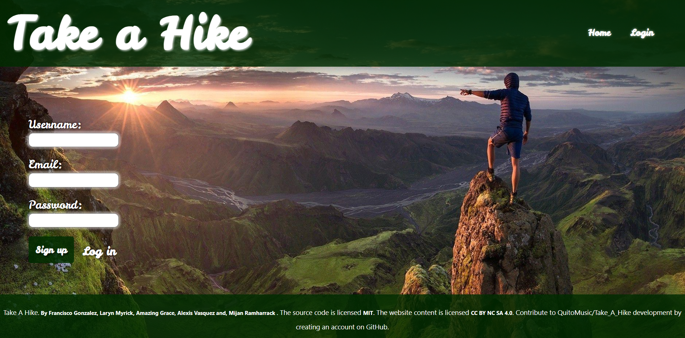
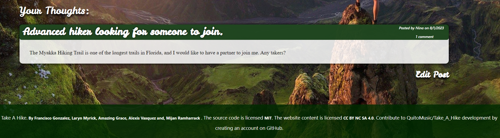
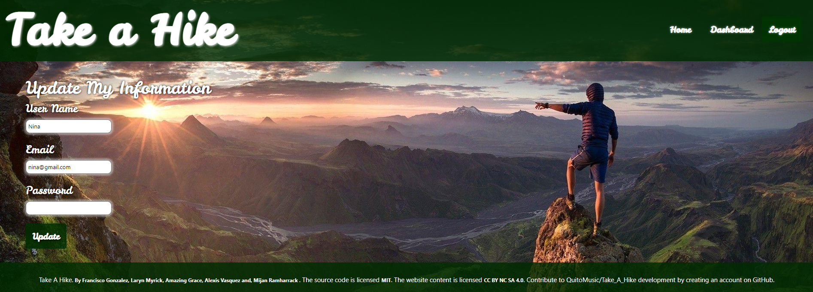
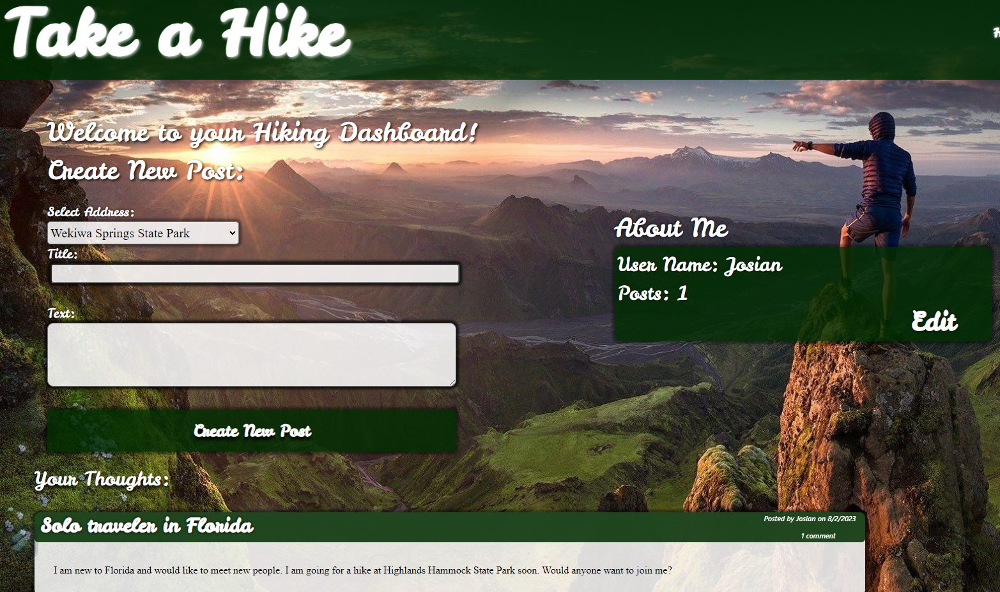

# Take A Hike

## Table of Contents
- [Description](#description)
- [Installation](#installation)
- [Usage](#usage)
- [Contributing](#contributing)
- [Tests](#tests)
- [Questions](#questions)
- [License](#license)

## Description

Take A Hike is a vibrant social platform connecting hikers of all backgrounds, fostering a community that celebrates the spirit of wanderlust, sharing personal journeys, and inspiring others to explore the boundless beauty of our planet's natural landscapes. Users can discover, organize, and join local and global hiking events, creating lasting connections with like-minded outdoor enthusiasts, and promoting an active lifestyle while fostering environmental awareness.

## Installation

First, search for repository on Github called Take_A_Hike. Then, on the top-right corner, click 'Code' and copy the link. Afterwards, go to VSCode and open the local terminal from the desired parent repostory where you desire to install the Take_A_Hike. Then, write 'git clone (paste link here)'. Finally, you'll notice the repository has been installed for your convenience. Make sure to write your credentials on the .env file, and download the proper dependencies (npm i). After all the dependencies have been downloaded, then we run the seeds (npm run seeds). Before making any changes, make sure that the propper dependencies have been downloaded to prevent bugs or functionality issues.

## Usage

First, right-click on the parent repository called Take_A_Hike and select "Open integrated terminal". As a rule, since we have a db folder with the files containing schema.sql and seeds.sql, we should always remember to run the MySql terminal by writing  "mysql -u root -p", write your password and then source each file writing "source schema.sql;" to write those files on the databases and display tables. Make sure you select the correct database by writing "Select * from <Database name>". Finally, write 'node server.js' on the terminal. At this point, the server should be running and the webpage will be rendered on your browser using localhost:3001.

## Contributing

If you would like to contribute as a developer, you can submit a pull request. Before starting any substantial work, it's recommended to open an issue to discuss your proposed changes with the lead developer.

## Tests

To test the application and make sure the data is being passed to the correct endpoints, we designed our own API that generates data directly into the software Insomnia.

1. To get the data from users, we have to make a GET hit: 
  

2. To get the data from individual users, we need to create a GET API hit as follows:
  

3. To get the Comments data we need to create a GET API hit as follows:
  

4. To get the individual Posts data we need to create a GET API hit as follows:
  

5. To get the Posts data we need to create a GET API hit as follows:
  

# Screenshots

## Next screenshots will create understanding of the website's functionality.
# a. Homepage .png>)
# b. Login Page
# c. Sign Up Page 
# d. Comment Page 
# e. Update Information Page 
# f. Create New Post Page 
 
 
## Refferences

1. <a href = https://www.w3schools.com/>W3Schools</a>

2. <a href = https://stackoverflow.com/>Community Forums & Stack Overflow</a>

3. <a href =https://expressjs.com/>Express.js</a>

4. <a href =https://www.codementor.io/>Codementor</a>

5. <a href =https://www.youtube.com/c/DevEd>DEV Ed YouTube</a>

6. <a href =https://www.reddit.com/r/node/>Reddit Node.js</a>

7. <a href =https://dev.to/>DEV Community</a>

8. <a href =https://calendly.com/d/dnc-wpf-c7s>UCF Tutors</a>

9. <a href =https://developer.mozilla.org/en-US/docs/Glossary/MVC>MDN Web Docs</a>

10. <a href =https://stackoverflow.com/questions/51696768/how-can-i-use-handlebars-with-express>How to use Handlebars with Express - Stackoverflow</a>

## Questions

For any questions, please contact us:

- GitHub: [QuitoMusic](https://github.com/QuitoMusic)

- Collaborators Emails:
1. <a href =f86gonzalez@outlook.com>Francisco Gonzalez</a>
2. <a href =laryn.n99@gmail.com>Laryn Myrick</a>
3. <a href =agracenotary@gmail.com>Amaizing Grace</a>
4. <a href =lexx.sunshineteam@gmail.com>Alexis Vasquez</a>
5. <a href =mijan@blackmesasystems.com>Mijan Ramharrack

## License

This project is licensed under the MIT License.
